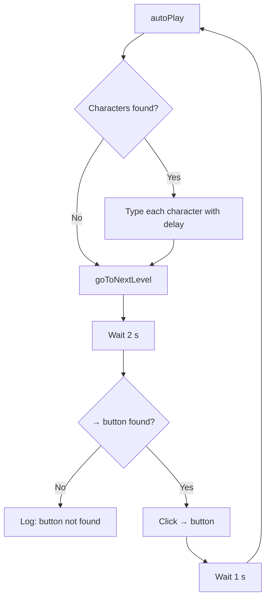

Typing Club Bot is built around four cooperating functions: `getTargetCharacters`, `recordKey`, `autoPlay`, and `goToNextLevel`. Together they form a recursive loop that reads a lesson, types it, then advances to the next level and repeats.



## DOM scanning

`getTargetCharacters` reads the full set of characters the lesson expects you to type by querying the live DOM.

```javascript
function getTargetCharacters() {
  const els = Array.from(document.querySelectorAll('.token span.token_unit'));
  const chrs = els
    .map(el => {
      if (el.firstChild?.classList?.contains('_enter')) {
        return '\n';
      }
      let text = el.textContent[0];
      return text;
    })
    .map(c => keyOverrides.hasOwnProperty(c) ? keyOverrides[c] : c);
  return chrs;
}
```

Every character position in a TypingClub lesson is rendered as a `<span class="token_unit">` element nested inside a `.token` element. The selector `.token span.token_unit` captures all of them in document order, which matches the intended typing sequence.

The function returns a plain array of strings — one element per character — that `autoPlay` iterates over.

<Info>
The DOM query runs once at the start of each lesson. If the page dynamically loads more characters after the initial render, those additions will not be included. In practice, TypingClub renders the full lesson content synchronously, so this is not an issue.
</Info>

## Special character handling

Two types of characters require translation before they can be sent to the TypingClub API.

### The ENTER key

When a lesson requires pressing Enter, TypingClub renders a child element with the class `_enter` inside the `token_unit` span rather than putting a newline character in `textContent`. The map step detects this and substitutes `'\n'`:

```javascript
if (el.firstChild?.classList?.contains('_enter')) {
  return '\n';
}
```

### Non-breaking spaces

TypingClub occasionally uses Unicode character 160 (non-breaking space, `\u00A0`) in lesson text. The internal API does not accept it as a valid space keystroke. The `keyOverrides` object maps it to a standard ASCII space before any character is sent:

```javascript
const keyOverrides = {
  [String.fromCharCode(160)]: ' '    // convert hardspace to normal space
};
```

The second `.map` call in `getTargetCharacters` applies this lookup to every character:

```javascript
.map(c => keyOverrides.hasOwnProperty(c) ? keyOverrides[c] : c)
```

You can extend `keyOverrides` to remap any other character. See [Configuration](/usage/configuration) for details.

## Keystroke injection

`recordKey` sends a single character to TypingClub's internal JavaScript API:

```javascript
function recordKey(chr) {
  window.core.record_keydown_time(chr);
}
```

`window.core` is a global object that TypingClub exposes on every lesson page. `record_keydown_time` is the same function the site's own keyboard event listeners call when a user presses a key. By calling it directly, the bot bypasses DOM event simulation entirely — the site treats each call as a genuine keystroke.

<Warning>
`window.core.record_keydown_time` is an undocumented internal API. TypingClub could rename or remove it in a future site update, which would break the bot.
</Warning>

## Async timing loop

`autoPlay` is the main execution loop. It calls `getTargetCharacters`, then iterates over the result, injecting each character and pausing between them:

```javascript
async function autoPlay() {
  const chrs = getTargetCharacters();
  if (chrs.length === 0) {
    goToNextLevel();
    return;
  }

  for (let i = 0; i < chrs.length; ++i) {
    const c = chrs[i];
    recordKey(c);
    await sleep(Math.random() * (maxDelay - minDelay) + minDelay);
  }

  goToNextLevel();
}
```

The delay between keystrokes is calculated as:

```
delay = Math.random() * (maxDelay - minDelay) + minDelay
```

With both `minDelay` and `maxDelay` set to `60`, `Math.random() * 0` is always `0`, so every keystroke fires at exactly 60 ms. Setting different values introduces a random spread, making the timing pattern less uniform.

If `getTargetCharacters` returns an empty array — which happens on non-typing screens such as intro slides — `autoPlay` skips the loop and goes straight to `goToNextLevel`.

`sleep` is a minimal utility that wraps `setTimeout` in a Promise:

```javascript
function sleep(ms) {
  return new Promise(r => setTimeout(r, ms));
}
```

## Level advancement

After typing is complete, `autoPlay` calls `goToNextLevel`:

```javascript
function goToNextLevel() {
  setTimeout(async () => {
    const nextButton = Array.from(document.querySelectorAll('span')).find(
      el => el.textContent === '→'
    );
    if (nextButton) {
      nextButton.click();
      console.log('Moving to next level...');

      await sleep(1000);
      autoPlay();
    } else {
      console.log('Next level button not found.');
    }
  }, 2000);
}
```

The function proceeds through three distinct phases:

<Steps>
  <Step title="Wait 2 seconds">
    A `setTimeout` of **2000 ms** delays the search for the next-level button. This gives TypingClub time to render the result screen after the final keystroke is submitted. If the result screen has not appeared by the time the timeout fires, the button scan will find nothing.
  </Step>
  <Step title="Scan for the → button">
    All `<span>` elements on the page are scanned with `Array.from(document.querySelectorAll('span')).find(el => el.textContent === '→')`. The first span whose text content is exactly `→` is treated as the next-level button and clicked.
  </Step>
  <Step title="Wait 1 second, then recurse">
    After clicking, `sleep(1000)` pauses for **1000 ms** to allow the next lesson page to load and its DOM to populate. Then `autoPlay()` is called again, restarting the cycle.
  </Step>
</Steps>

If no `→` button is found, a message is logged to the console and the loop stops. This happens at the end of a lesson set when there is no next level to advance to.

## The recursive loop

The relationship between `autoPlay` and `goToNextLevel` forms an implicit recursive loop:

```
autoPlay()
  └─ finishes typing
  └─ calls goToNextLevel()
        └─ waits 2 s
        └─ clicks → button
        └─ waits 1 s
        └─ calls autoPlay()   ← back to the top
```

This is not tail recursion in the traditional sense — each call creates a new async execution context — but JavaScript's event loop handles it without stack overflow because each recursive entry point is separated by `await sleep(...)` or `setTimeout(...)`, yielding control back to the browser between steps.

<CardGroup cols={2}>
  <Card title="Configuration" icon="sliders" href="/usage/configuration">
    Adjust typing speed, delays, and character mappings
  </Card>
  <Card title="Script API" icon="code" href="/reference/script-api">
    Full reference for every function in the script
  </Card>
</CardGroup>
